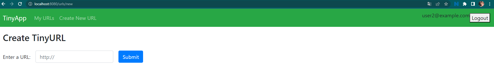
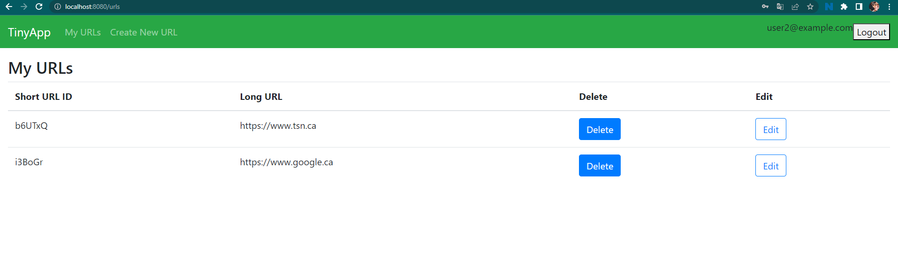
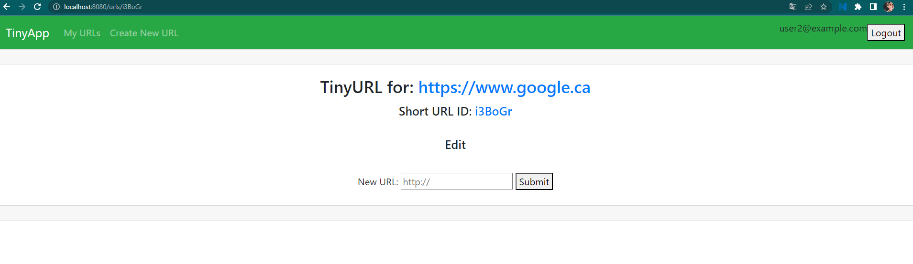

# TinyApp Project

TinyApp is a full stack web application built with Node and Express that allows users to shorten long URLs (à la bit.ly).

## Final Product

## Dependencies

- Node.js
- Express
- EJS
- bcryptjs
- cookie-session

## Getting Started

- Install all dependencies (using the `npm install` command).
- Run the development web server using the `node express_server.js` command.
- Open a browser and go to `localhost:8080/register` page.
- First thing first you have to register an account. Without an account you won't be able to access the features of the website. The email you register shouldn't already exist in our user database.
- After you register, you will be automatically log-in. However, using the same credentials you can log-in again on `localhost:8080/login`
- Once you are logged in, you can create short URLs. Click on `Create New URL` button or go to `localhost:8080/urls/new`. Enter your long URL and submit it. Make sure your long URL starts with `htttp://` or `https://`.
- After you generate your TinyURL you will be directed to the `Edit` page of your TinyURL where you can see both long and short urls but also can edit the long URL.
- You can also click on `My URL` or go to `localhost:8080/urls` where you can see all your TinyURLs. You can also delete some of your TinyURLs in this page.

